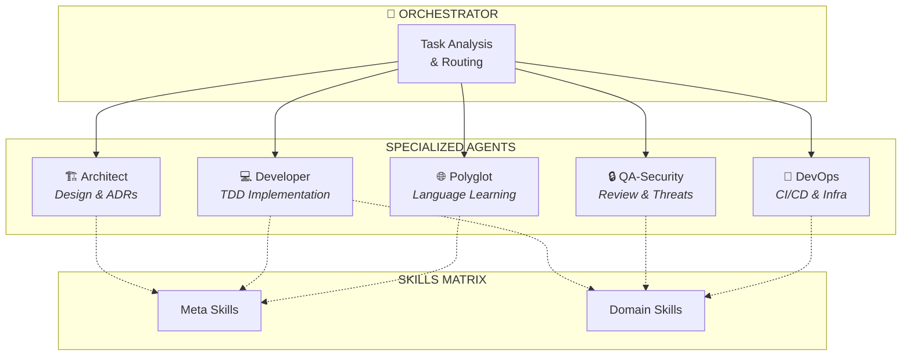
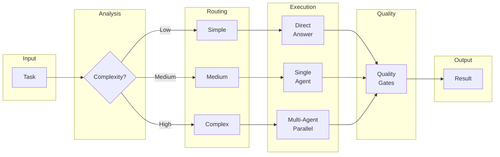
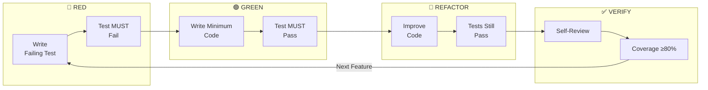
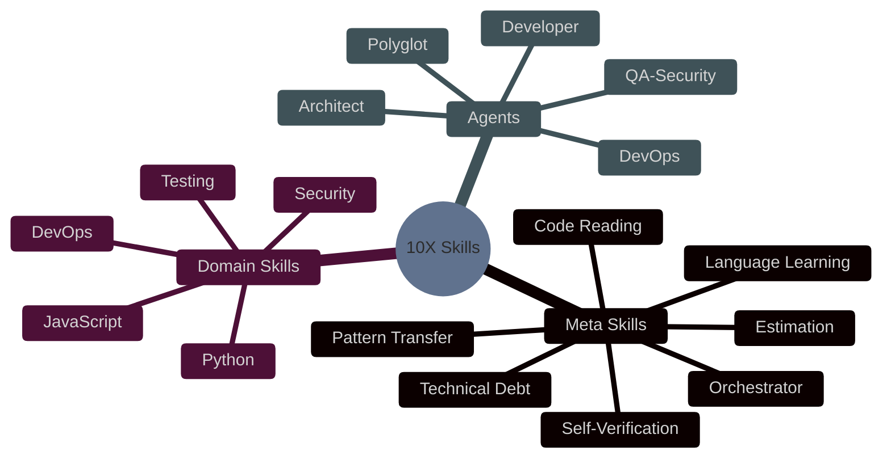
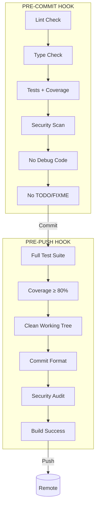
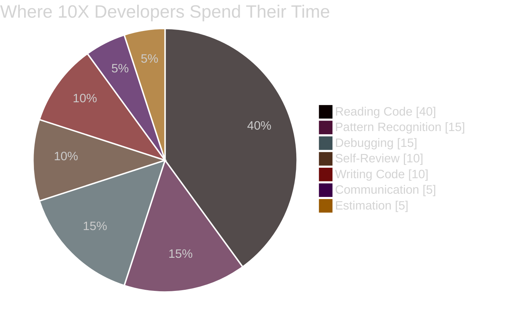

# 10X Developer Unicorn

> An agent orchestration system that encodes the "hidden 80%" of software engineering expertise into Claude Code.

[](LICENSE)
[]()
[](https://claude.ai)

## What is This?

Most AI coding assistants focus on the visible 20%—writing code, answering syntax questions, generating boilerplate. But real 10X developers spend 80% of their time on skills that are rarely taught:

- **Reading code** strategically (not linearly)
- **Recognizing patterns** across languages and domains
- **Estimating accurately** with risk awareness
- **Self-reviewing** before anyone else sees the code
- **Managing technical debt** deliberately

This system encodes those skills into a coordinated team of specialized agents.

## Architecture



### The 5+1 Agent Model

| Agent | Role | Model | Specialty |
|-------|------|-------|-----------|
| **Orchestrator** | Coordination | Fast | Routes tasks, manages context, enforces quality gates |
| **Architect** | Design | Opus | System design, ADRs, API contracts, tradeoff analysis |
| **Developer** | Implementation | Opus | TDD-first coding in Python, JS/TS, Go, Rust |
| **QA-Security** | Quality | Sonnet | Code review, STRIDE threat modeling, security scans |
| **DevOps** | Operations | Sonnet | CI/CD, Docker, Kubernetes, observability |
| **Polyglot** | Learning | Opus | Rapid language acquisition, pattern transfer |

## Workflow



## TDD Workflow

Every implementation follows strict Test-Driven Development:



## Quick Start

```bash
# Clone the repository
git clone https://github.com/aj-geddes/unicorn-team.git
cd unicorn-team

# Install the system
./scripts/install.sh

# Verify installation
pytest tests/ -v
```

### Prerequisites

- Python 3.10+
- Git
- One of: pytest, npm, go, cargo (depending on your projects)

## Skills Matrix



### Meta Skills (The Hidden 80%)

| Skill | Purpose | Trigger |
|-------|---------|---------|
| `orchestrator` | Route tasks to appropriate agents | "implement", "build", "create" |
| `self-verification` | Quality check before every commit | "review", "check", "before commit" |
| `code-reading` | Strategic code comprehension | "understand", "how does this work" |
| `pattern-transfer` | Apply patterns across domains | "I've seen this before", "like X but in Y" |
| `estimation` | Risk-aware time estimation | "how long", "estimate" |
| `technical-debt` | Track and manage debt deliberately | "tech debt", "shortcuts", "cleanup" |
| `language-learning` | Rapid language acquisition | "learn", "new language" |

### Domain Skills

| Skill | Coverage |
|-------|----------|
| `python` | Type hints, pytest, async, tooling (ruff, mypy, poetry) |
| `javascript` | TypeScript, React, Node.js, Jest/Vitest |
| `testing` | TDD, mocking strategies, coverage, cross-language patterns |
| `security` | OWASP Top 10, STRIDE, input validation, secrets management |
| `devops` | Docker, Kubernetes, GitHub Actions, observability |

## Project Structure

```
unicorn-team/
├── skills/
│   ├── unicorn/                    # Meta-skills
│   │   ├── orchestrator/SKILL.md
│   │   ├── self-verification/SKILL.md
│   │   ├── code-reading/SKILL.md
│   │   ├── pattern-transfer/SKILL.md
│   │   ├── estimation/SKILL.md
│   │   ├── technical-debt/SKILL.md
│   │   └── language-learning/
│   │       ├── SKILL.md
│   │       └── references/         # Deep-dive docs
│   ├── agents/                     # Agent definitions
│   │   ├── developer.md
│   │   ├── architect.md
│   │   ├── qa-security.md
│   │   ├── devops.md
│   │   ├── polyglot.md
│   │   └── references/
│   └── domain/                     # Domain expertise
│       ├── python/
│       ├── javascript/
│       ├── testing/
│       ├── security/
│       └── devops/
├── hooks/
│   ├── pre-commit                  # Quality gate before commit
│   └── pre-push                    # Full validation before push
├── scripts/
│   ├── install.sh                  # One-command setup
│   ├── tdd.sh                      # TDD workflow helper
│   ├── self-review.sh              # Pre-commit checklist
│   ├── estimate.sh                 # PERT estimation tool
│   └── new-language.sh             # Language learning protocol
├── tests/
│   ├── test_skills_valid.py        # Skill validation
│   ├── test_scripts.py             # Script validation
│   └── test_hooks.py               # Hook validation
└── docs/
    ├── architecture.md             # Full architecture spec
    ├── hidden-skills.md            # The 80% skills deep-dive
    ├── implementation-guide.md     # Quickstart guide
    └── TROUBLESHOOTING.md          # Common issues & fixes
```

## Scripts Reference

### TDD Workflow
```bash
./scripts/tdd.sh user-authentication
```

Guides you through RED → GREEN → REFACTOR with enforcement:
- Creates test file in correct location
- **Fails if tests pass in RED phase** (non-negotiable)
- Runs coverage report in REFACTOR phase

### Self-Review
```bash
./scripts/self-review.sh
```

Interactive pre-commit checklist:
- Shows staged changes
- Checks for TODOs, debug code, secrets
- Runs tests with coverage
- Asks "Would you approve this PR?"

### Estimation
```bash
./scripts/estimate.sh
```

PERT-based estimation helper:
- Breaks down tasks into subtasks
- Collects optimistic/realistic/pessimistic estimates
- Calculates risk buffers
- Outputs: "X hours (±Y hours) assuming Z. Risks: A, B, C."

### Language Learning
```bash
./scripts/new-language.sh rust
```

5-phase protocol (< 4 hours to productive):
1. **Exploration** (30 min) - Hello World, toolchain
2. **Patterns** (60 min) - Map to known patterns
3. **Ecosystem** (30 min) - Package manager, testing
4. **Idioms** (60 min) - Community conventions
5. **Production** (60 min) - Deployment, monitoring

## Quality Gates



### What Gets Checked

| Check | Pre-Commit | Pre-Push |
|-------|:----------:|:--------:|
| Linting (ruff/eslint) | ✅ | ✅ |
| Type checking (mypy/tsc) | ✅ | ✅ |
| Unit tests | ✅ | ✅ |
| Coverage threshold (80%) | ✅ | ✅ |
| Security scan (bandit/npm audit) | ✅ | ✅ |
| No debug code | ✅ | ✅ |
| No TODO/FIXME/HACK | ✅ | ✅ |
| Full test suite | ❌ | ✅ |
| Commit message format | ❌ | ✅ |
| Clean working tree | ❌ | ✅ |

## The 10X Philosophy

### What Makes a 10X Developer?

It's not typing speed. It's not knowing more languages. It's the **invisible skills**:



### The Iceberg Model

```
        ┌─────────────────────────┐
        │    VISIBLE (20%)        │
        │  • Writing code         │
        │  • Using frameworks     │
        │  • Syntax knowledge     │
~~~~~~~~│~~~~~~~~~~~~~~~~~~~~~~~~~│~~~~~~~~ Surface
        │    HIDDEN (80%)         │
        │  • Strategic reading    │
        │  • Pattern transfer     │
        │  • Risk estimation      │
        │  • Self-verification    │
        │  • Debt management      │
        │  • Security mindset     │
        │  • Observability design │
        └─────────────────────────┘
```

This system encodes the 80% that's usually learned through years of experience.

## Contributing

### Development Rules

1. **TDD Always**: RED → GREEN → REFACTOR. No exceptions.
2. **Self-Review**: Run `./scripts/self-review.sh` before every commit.
3. **Quality Gates**: All hooks must pass.
4. **Skill Standards**: SKILL.md files must be < 500 lines (use references/).

### Commit Convention

```
type(scope): description

Types: feat, fix, docs, skill, script, test, refactor
Scope: orchestrator, developer, qa, devops, hooks, etc.

Examples:
- feat(orchestrator): add delegation matrix
- skill(code-reading): implement strategic reading protocol
- script(tdd): add coverage threshold check
```

### Adding a New Skill

1. Create `skills/<category>/<skill-name>/SKILL.md`
2. Add YAML frontmatter with `name` and `description`
3. Keep body under 500 lines
4. Add detailed content to `references/` if needed
5. Run `pytest tests/test_skills_valid.py -v`

## Documentation

| Document | Purpose |
|----------|---------|
| [Architecture](docs/architecture.md) | Full system specification |
| [Hidden Skills](docs/hidden-skills.md) | Deep-dive into the 80% |
| [Implementation Guide](docs/implementation-guide.md) | Quickstart and examples |
| [Troubleshooting](docs/TROUBLESHOOTING.md) | Common issues and fixes |

## Statistics

- **61 files** in the system
- **39,000+ lines** of content
- **12 skills** with **25 reference documents**
- **5 automation scripts**
- **2 git hooks**
- **62 validation tests** (all passing)

## License

MIT License - see [LICENSE](LICENSE) for details.

---

<p align="center">
  <i>Built with the 10X methodology using Claude Code</i>
</p>
