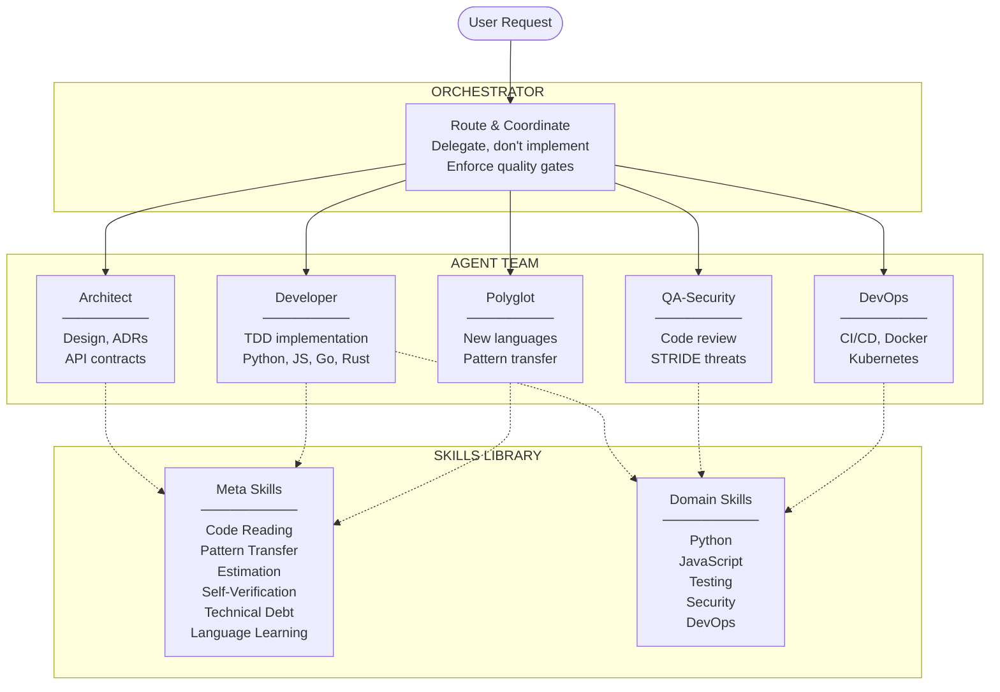
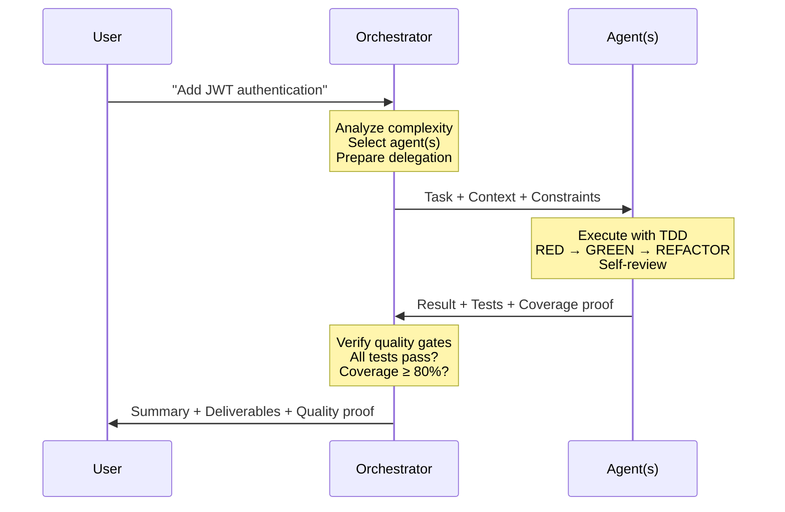
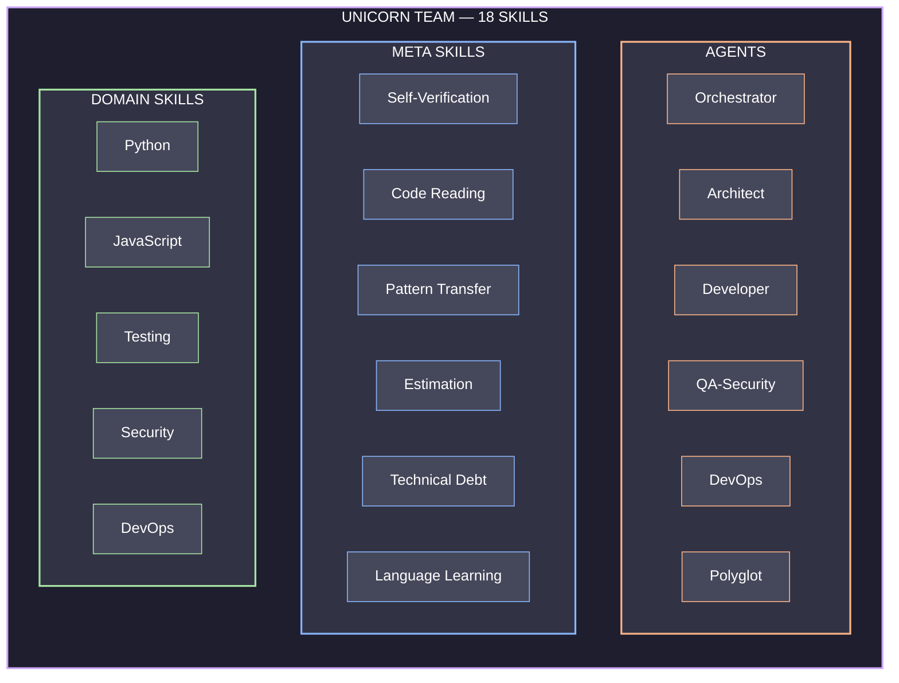
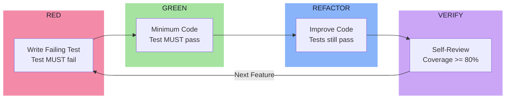
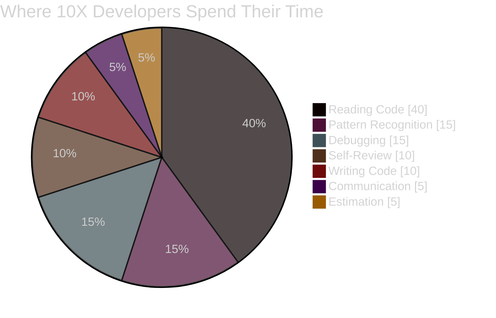

# 10X Developer Unicorn

> An agent orchestration system for Claude Code that encodes the "hidden 80%" of software engineering expertise into 18 skills and 6 specialized agents.

[]()
[]()
[](https://claude.ai)
[](LICENSE)

## What is This?

Most AI coding assistants focus on the visible 20% — writing code, answering syntax questions, generating boilerplate. Real 10X developers spend 80% of their time on skills that are rarely taught: reading code strategically, recognizing cross-domain patterns, estimating with risk awareness, self-reviewing before anyone sees the code, and managing technical debt deliberately.

This system encodes those skills into a coordinated team of specialized agents that Claude Code can use automatically.

## Quick Start

```bash
git clone https://github.com/aj-geddes/unicorn-team.git
cd unicorn-team
./scripts/install.sh
```

That's it. The installer:
- Symlinks all 18 skills into `.claude/skills/` so Claude Code auto-discovers them
- Wires git hooks (pre-commit quality gate, pre-push validation)
- Makes all co-located scripts executable

### Install Options

| Flag | Effect |
|------|--------|
| *(default)* | Project-level install to `.claude/skills/` (symlinks) |
| `--global` | User-wide install to `~/.claude/skills/` (copies) + orchestrator activation in `~/.claude/CLAUDE.md` |
| `--force` | Overwrite existing skills and hooks |
| `--uninstall` | Remove installed skills |

### Prerequisites

- Python 3.10+ (for tests)
- Git
- [Claude Code](https://docs.anthropic.com/en/docs/claude-code)

## Architecture



### How Delegation Works

Every substantial task goes through the orchestrator, which routes to the right agent with clear context, constraints, and expected output. Agents return structured results with quality proof.



### Routing

```
Simple question        → Answer directly (no agent needed)
Code implementation    → Developer (with TDD)
Architecture decision  → Architect (ADR + diagrams)
Code review            → QA-Security (4-layer review)
Deployment / infra     → DevOps (pipelines + manifests)
New language           → Polyglot → Developer
Complex multi-domain   → Parallel delegation → Aggregate
```

## Skills

### Agents (6)

Each agent is a skill with its own `SKILL.md`, `references/`, and optional `scripts/`.

| Agent | Purpose | Key Outputs |
|-------|---------|-------------|
| **Orchestrator** | Routes tasks, enforces quality gates, manages context | Delegation plans, quality reports |
| **Architect** | System design, API contracts, tradeoff analysis | ADRs, Mermaid diagrams, API specs |
| **Developer** | TDD implementation across languages | Code + tests (always RED → GREEN → REFACTOR) |
| **QA-Security** | Code review, STRIDE threat modeling | Pass/fail reports with specific findings |
| **DevOps** | CI/CD, containers, infrastructure, observability | Pipelines, K8s manifests, runbooks |
| **Polyglot** | Rapid language acquisition, pattern transfer | Quick reference cards, idiomatic patterns |

### Meta Skills (6)

The "hidden 80%" — skills that separate experienced engineers from beginners.

| Skill | What It Does | Trigger Phrases |
|-------|-------------|-----------------|
| **Self-Verification** | Quality checks before every commit | "review", "check my code", "before commit" |
| **Code Reading** | Strategic code comprehension (not linear reading) | "understand this", "how does this work", "read this codebase" |
| **Pattern Transfer** | Recognize and apply patterns across domains | "I've seen this before", "like X but in Y", "equivalent of" |
| **Estimation** | Risk-aware PERT estimation with decomposition | "how long", "estimate", "when will this be done" |
| **Technical Debt** | Track, classify, and manage debt deliberately | "tech debt", "shortcuts", "cleanup", "refactor" |
| **Language Learning** | 5-phase protocol: zero to productive in < 4 hours | "learn Rust", "new language", "getting started with" |

### Domain Skills (5)

Language and platform expertise with project-specific conventions.

| Skill | Coverage |
|-------|----------|
| **Python** | Type hints (3.10+), pytest, async, ruff, mypy, poetry |
| **JavaScript** | TypeScript, React patterns, Node.js, Vitest, ESLint |
| **Testing** | TDD protocol, mocking strategies, coverage, cross-language patterns |
| **Security** | OWASP Top 10, STRIDE, input validation, secrets management |
| **DevOps** | Docker, Kubernetes, GitHub Actions, observability stack |

### Skills Matrix



## TDD Workflow

Every implementation follows strict Test-Driven Development. No exceptions.



## Quality Gates

Two layers of automated quality enforcement via git hooks.

```mermaid
flowchart LR
    subgraph Commit["PRE-COMMIT"]
        C1["Lint"] --> C2["Type Check"] --> C3["Tests + Coverage"] --> C4["Security Scan"] --> C5["No Debug Code"] --> C6["No Task Markers"]
    end

    subgraph Push["PRE-PUSH"]
        P1["Full Test Suite"] --> P2["Coverage >= 80%"] --> P3["Clean Tree"] --> P4["Commit Format"] --> P5["Security Audit"]
    end

    C6 -->|git commit| P1
    P5 -->|git push| Remote([Remote])

    style Commit fill:#313244,stroke:#89b4fa,color:#ffffff
    style Push fill:#313244,stroke:#fab387,color:#ffffff
```



| Check | Pre-Commit | Pre-Push |
|-------|:----------:|:--------:|
| Linting (ruff/eslint/clippy) | Yes | Yes |
| Type checking (mypy/tsc) | Yes | Yes |
| Tests with coverage | Yes | Yes |
| Security scan (bandit/npm audit) | Yes | Yes |
| No debug code | Yes | Yes |
| No task markers | Yes | Yes |
| Commit message format | | Yes |
| Clean working tree | | Yes |

Hooks auto-detect project type (Python, Node, Go, Rust) and run the appropriate toolchain.

## Scripts

Scripts are co-located with their owning skills.

| Script | Location | Usage |
|--------|----------|-------|
| **install.sh** | `scripts/install.sh` | `./scripts/install.sh [--global] [--force]` |
| **tdd.sh** | `skills/agents/developer/scripts/tdd.sh` | `./skills/agents/developer/scripts/tdd.sh <feature>` |
| **self-review.sh** | `skills/unicorn/self-verification/scripts/self-review.sh` | `./skills/unicorn/self-verification/scripts/self-review.sh` |
| **estimate.sh** | `skills/unicorn/estimation/scripts/estimate.sh` | `./skills/unicorn/estimation/scripts/estimate.sh` |
| **new-language.sh** | `skills/unicorn/language-learning/scripts/new-language.sh` | `./skills/unicorn/language-learning/scripts/new-language.sh <lang>` |

## Project Structure

```
unicorn-team/
├── CLAUDE.md                              # Orchestrator activation + dev rules
├── README.md
├── .gitignore
├── scripts/
│   └── install.sh                         # One-command Claude Code installer
├── skills/
│   ├── agents/                            # Agent definitions (6)
│   │   ├── orchestrator/                  # The coordinator brain
│   │   │   ├── SKILL.md
│   │   │   └── references/
│   │   ├── developer/
│   │   │   ├── SKILL.md
│   │   │   ├── references/
│   │   │   └── scripts/tdd.sh
│   │   ├── architect/
│   │   │   ├── SKILL.md
│   │   │   └── references/
│   │   ├── qa-security/
│   │   │   ├── SKILL.md
│   │   │   └── references/
│   │   ├── devops/
│   │   │   ├── SKILL.md
│   │   │   └── references/
│   │   └── polyglot/
│   │       ├── SKILL.md
│   │       ├── references/
│   │       └── scripts/new-language.sh
│   ├── unicorn/                           # Meta-skills (6)
│   │   ├── self-verification/
│   │   │   ├── SKILL.md
│   │   │   ├── references/
│   │   │   └── scripts/self-review.sh
│   │   ├── code-reading/
│   │   ├── pattern-transfer/
│   │   ├── estimation/
│   │   │   ├── SKILL.md
│   │   │   ├── references/
│   │   │   └── scripts/estimate.sh
│   │   ├── technical-debt/
│   │   └── language-learning/
│   │       ├── SKILL.md
│   │       ├── references/
│   │       └── scripts/new-language.sh
│   ├── domain/                            # Domain skills (5)
│   │   ├── python/
│   │   ├── javascript/
│   │   ├── testing/
│   │   ├── security/
│   │   └── devops/
│   └── hvs-skill-buddy/                  # Skill library auditor
├── hooks/
│   ├── pre-commit                         # Quality gate on commit
│   └── pre-push                           # Full validation on push
├── tests/
│   ├── test_skills_valid.py
│   ├── test_scripts.py
│   └── test_hooks.py
└── docs/
    ├── architecture.md
    ├── hidden-skills.md
    ├── implementation-guide.md
    └── TROUBLESHOOTING.md
```

## The 10X Philosophy

Most developers focus on the visible part of software engineering. This system encodes the invisible part.

```
        ┌─────────────────────────────┐
        │      VISIBLE (20%)          │
        │   Writing code              │
        │   Using frameworks          │
        │   Syntax knowledge          │
~~~~~~~~│~~~~~~~~~~~~~~~~~~~~~~~~~~~~~│~~~~~~~~
        │      HIDDEN (80%)           │
        │   Strategic code reading    │
        │   Cross-domain patterns     │
        │   Risk-aware estimation     │
        │   Self-verification         │
        │   Technical debt mgmt       │
        │   Security mindset          │
        │   Observability design      │
        └─────────────────────────────┘
```



## Contributing

### Adding a New Skill

1. Create `skills/<category>/<skill-name>/SKILL.md`
2. Add YAML frontmatter with `name` and `description` (include trigger phrases)
3. Keep body under 500 lines — extract detail to `references/`
4. Co-locate scripts in `scripts/` within the skill directory
5. Run `pytest tests/test_skills_valid.py -v`

### Commit Convention

```
type(scope): description

Types: feat, fix, docs, skill, script, test, refactor
Scope: orchestrator, developer, qa, devops, hooks, etc.

Examples:
  feat(orchestrator): add parallel delegation support
  skill(estimation): add PERT calculation reference
  fix(pre-commit): handle missing ruff binary
```

### Running Tests

```bash
pytest tests/ -v                    # All 84 tests
pytest tests/test_skills_valid.py   # Skill validation only
pytest tests/test_scripts.py        # Script validation only
pytest tests/test_hooks.py          # Hook validation only
```

## Stats

- **18 skills** across 3 categories
- **6 agents** with specialized roles
- **58 reference documents** for deep-dive content
- **6 automation scripts** (co-located with owning skills)
- **2 git hooks** (pre-commit + pre-push)
- **84 tests** (all passing)

## License

MIT License — see [LICENSE](LICENSE) for details.

---

<p align="center">
  <i>Built with the 10X methodology using Claude Code</i>
</p>
